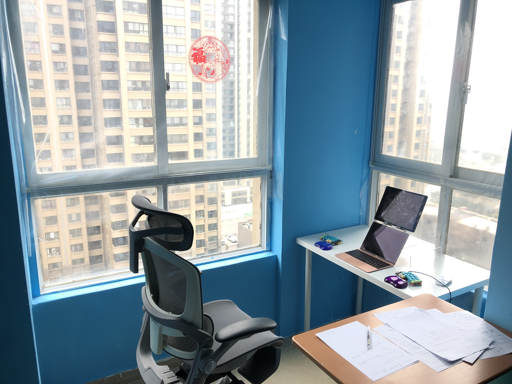

## 欢迎来到槟阳的艺术工作室！

### 我是韩槟阳，一个21岁的男性。我收集美和真理。
### 别人写的好东西，我将给出链接。我自己写的东西，收集在本站里。

### 年轻的力量
电脑是近代最伟大的发明之一。[电脑能做什么?写给每个地球人](computer.md)

量子物理是最新的科技革命。读读这些[量子物理入门读物](quantum.md)吧。

### 史海钩沉

遗传至今的，身体对[运动](sports.md)的需求。

作为人，对美的渴望，对[艺术](arts.md)的需求。

### 我自己也会有些小小的想法。同样会记录在这里。

_一个四海为家的年轻人思考和学习的地方_
- 大学生对未来的思考 价值
- 没有区别 我不知道
- qq 微信缺乏美但是很有意义
- 找到“自己的世界”
- 分体键盘
- 输入法默认英文 键盘配列
- 睡眠 运动 饮食
